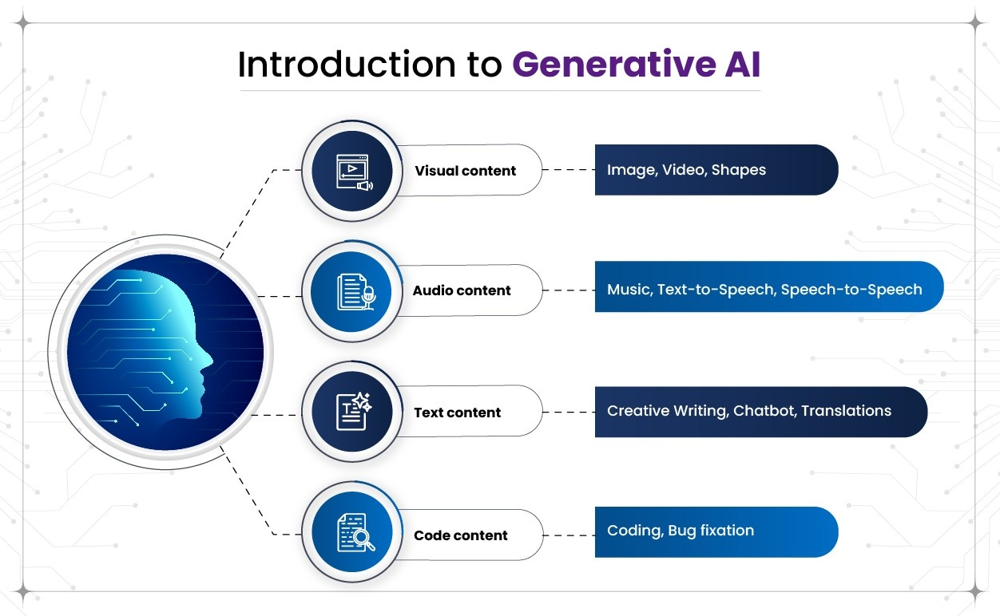

# What is Generative AI and How Can It Help Us?

Generative AI is one of the most exciting advancements in artificial intelligence. Unlike traditional AI systems that classify data or make predictions, **Generative AI creates new content**—whether it’s text, images, music, code, or even 3D models.  

At its core, Generative AI uses **machine learning models** trained on vast amounts of data to learn patterns, styles, and structures. Once trained, it can generate fresh outputs that look and feel as though they were created by humans.

---

## How Does Generative AI Work?

Generative AI is typically powered by **large neural networks** (e.g., GPT, Claude, Stable Diffusion, DALL·E). These models learn through:
1. **Training on massive datasets** – e.g., books, articles, images, videos, or audio.
2. **Identifying patterns and relationships** in the data.
3. **Generating new outputs** that mirror the style, tone, or characteristics of the training data.

---

## Applications of Generative AI

Generative AI is transforming industries across the globe:

- **Content Creation**  
  Write articles, blogs, marketing copy, or creative stories in seconds.

- **Design and Creativity**  
  Generate logos, digital art, or product prototypes.

- **Software Development**  
  Auto-generate code snippets, documentation, or test cases.

- **Healthcare**  
  Assist in drug discovery, medical image analysis, and personalized treatment plans.

- **Education**  
  Provide personalized tutoring, question generation, and study guides.

- **Business Productivity**  
  Summarize long documents, generate reports, and improve customer support via AI chatbots.

---

## Benefits of Generative AI

- **Boosts productivity** by automating repetitive or time-consuming tasks.  
- **Enhances creativity** by acting as a collaborator that sparks new ideas.  
- **Saves costs** by reducing manual effort in design, writing, and research.  
- **Personalizes experiences** by tailoring recommendations, learning materials, or support.  

